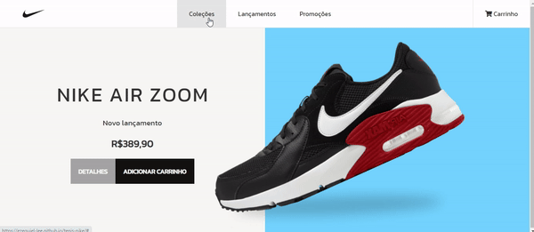

# Landing page Tênis da Nike
<svg
          height="50px"
          style="enable-background: new 0 0 512 512"
          version="1.1"
          viewBox="0 0 512 512"
          width="50px"
          xml:space="preserve"
          xmlns="http://www.w3.org/2000/svg"
          xmlns:xlink="http://www.w3.org/1999/xlink"
        >
          <path
            d="M453.14,183.77c-1.328,0.332-296.636,80.361-296.636,80.361    c-5.7,1.6-11.522,2.429-17.188,2.459c-22.696,0.134-42.891-12.463-42.728-39.01c0.066-10.389,3.247-22.912,10.613-37.647    C81.173,220.5,56.213,258.41,55.962,286.744c-0.096,10.661,3.306,19.969,11.47,27.022c11.75,10.146,24.693,13.728,37.576,13.748    c18.825,0.026,37.518-7.568,52.155-13.424c24.651-9.858,297.129-128.185,297.129-128.185    C456.921,184.59,456.427,182.947,453.14,183.77z"
            style="fill-rule: evenodd; clip-rule: evenodd; fill: #fff"
          />
        </svg>
## Resumo

Esta é uma página de compra de um tênis da Nike feita com HTML e CSS, também é responsivo. Uma página simples de compra com botões hover.
Fiz pequenas melhorias na responsividade.

(Projeto criado de um desafio do site [DevMentor](https://www.devmentor.com.br/))

## Tecnologias Utilizadas

  
  

## Veja o funcionamento!

Neste GIF animado, você pode conferir o projeto em pleno funcionamento e responsivo.

## Acesse o Projeto

Você pode acessar o projeto através do GitHub Pages. Clique no link abaixo para testar:

➜ [Link do Projeto](https://ezequiel-lee.github.io/tenis-nike/)

